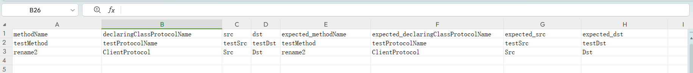
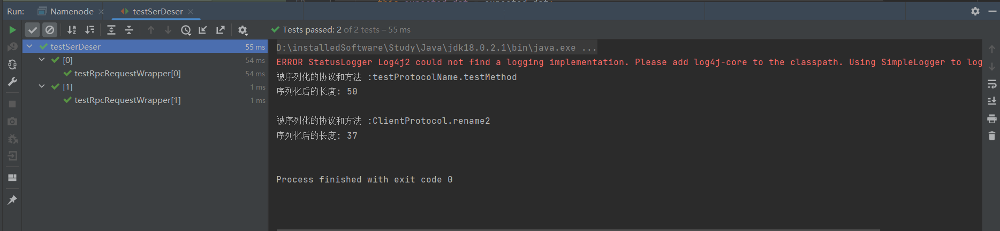
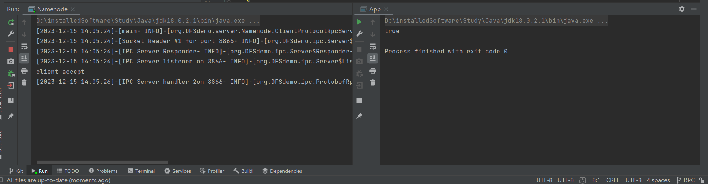

# RPC模块

## 一、简介

这是一个基于JDK18，序列化方式基于Protobuf实现的针对分布式文件系统的一个高性能RPC框架。目前实现了以下功能：

- 可以当作一个序列化框架使用。该框架能够扩展序列化方式，实现多种序列化数据的功能；
- 客户端声明协议接口和编写.proto文件，服务端实现客户端声明的接口，可以实现客户端方法的远程实现；
- 服务端采用多Reactor多线程模式，性能强大。

## 二、整体架构
RPC框架分为了三层：

一次RPC调用流程：

服务端架构：


## 三、应用层协议
### 1.建立连接发送的信息
```
------------------Header----------------------
myrpc(5字节)：应用层协议类型，和HTTP等进行区分
Service Class(1字节)：服务类型，指Client和NameNode，或者DataNode与NameNode等服务
AuthProtocol(1字节)：客户端身份认证协议


-------------------Content--------------------
---content header---
RpcKindPtoto：序列化类型
OperationProto：指示服务端连接的操作
callId：唯一标识一个client发来的call
clientId：唯一标识客户端
retryCount：一个call的重试次数

---content content---
protocol：协议接口
```

### 2.一次rpc发送的信息
```
------------------Header--------------------
---header header---
RpcKindPtoto：序列化类型
OperationProto：指示服务端连接的操作
callId：唯一标识一个client发来的call
clientId：唯一标识客户端
retryCount：一个call的重试次数

---header content---
protocol：协议接口


-----------------Content---------------------
---content header---
methodName：方法名
declaringClassProtocolName：协议接口名

---content content---
请求参数
```

### 3.rpc结果信息
```
------------------Header--------------------
callId：唯一标识一个client发来的call
clientId：唯一标识客户端
status ：Rpc调用的状态( SUCCESS/ERROR/FATAL)
exceptionClassName：异常类类名
errorMsg：错误的栈踪
errorDetail：定义的一些具体的错误信息
retryCount：一个call的重试次数

-----------------Content---------------------
具体的返回值

```

## 四、效果

### 1.测试序列化效果

测试数据：



测试代码：

```Java
@Test
public void testRpcRequestWrapper() throws Exception{
    /**
     * 创建并设置header和req的值
     */
    ProtobufRpcEngineProtos.RequestHeaderProto header = ProtobufRpcEngineProtos.RequestHeaderProto.newBuilder()
            .setMethodName(methodName)
            .setDeclaringClassProtocolName(declaringClassProtocolName)
            .build();
    ClientNamenodeProtocolProtos.rename2RequestProto req = ClientNamenodeProtocolProtos.rename2RequestProto.newBuilder()
            .setSrc(src)
            .setDst(dst)
            .build();

    /**
     * 序列化header和req
     */
    Class clazz = Class.forName("org.DFSdemo.ipc.ProtobufRpcEngine$RpcRequestWrapper");
    Constructor constructor = clazz.getConstructor(ProtobufRpcEngineProtos.RequestHeaderProto.class, Message.class);
    constructor.setAccessible(true);
    Object rpcReqWrapper = constructor.newInstance(header, req);
    System.out.println("被序列化的协议和方法 :" + rpcReqWrapper);

    ByteArrayOutputStream bo = new ByteArrayOutputStream();
    DataOutputStream out = new DataOutputStream(bo);//因为write方法参数是DataOutput类型的，所有要将输出流转为DataOutput或其子类类型
    Method writeMethod = clazz.getMethod("write",DataOutput.class);
    writeMethod.setAccessible(true);
    writeMethod.invoke(rpcReqWrapper, out);//序列化
    System.out.println("序列化后的长度: " + bo.toByteArray().length);
    System.out.print("\n");

    /**
     * 反序列化header
     */
    Constructor defaultConstructor = clazz.getConstructor();
    defaultConstructor.setAccessible(true);//获取无参构造器
    Object newRpcReqWrapper = defaultConstructor.newInstance();

    Field theRequestReadField = clazz.getSuperclass().getDeclaredField("theRequestRead");//获取父类的theRequestRead字段
    theRequestReadField.setAccessible(true);

    ByteArrayInputStream baInputStream = new ByteArrayInputStream(bo.toByteArray());
    DataInput in = new DataInputStream(baInputStream);
    Method readFieldsMethod = clazz.getMethod("readFields", DataInput.class);
    readFieldsMethod.setAccessible(true);
    //反序列化。
    //由于RpcRequestWrapper类中对于theRequest的反序列化未完成，所以需要proto类来反序列化
    readFieldsMethod.invoke(newRpcReqWrapper, in);

    /**
     * header反序列化已经完成，现在进行单元测试
     */
    Assert.assertEquals(expected_methodName, header.getMethodName());
    Assert.assertEquals(expected_declaringClassProtocolName, header.getDeclaringClassProtocolName());

    /**
     * 反序列化req，进行单元测试
     */
    byte[] theRequestRead = (byte[]) theRequestReadField.get(newRpcReqWrapper);
    ClientNamenodeProtocolProtos.rename2RequestProto deSerReq = ClientNamenodeProtocolProtos.rename2RequestProto.parseFrom(theRequestRead);
    Assert.assertEquals(expected_src, deSerReq.getSrc());
    Assert.assertEquals(expected_dst, deSerReq.getDst());
}
```

测试结果：



### 2.测试rpc效果

在客户端声明协议接口：

```java
public interface ClientProtocol 
    public boolean rename2(String src, String dst) throws IOException;
}
```

完成.proto编写：

```protobuf
/**
  * ClientNamenodeProtocol Service定义了客户端与服务端之间的接口
  * 定义的方法同 org.DFSDemo.protocol.ClientProtocol
  */

syntax = "proto3";

option java_package = "org.DFSdemo.protocol.proto";
option java_outer_classname = "ClientNamenodeProtocolProtos";
option java_generic_services = true;
option java_generate_equals_and_hash = true;
package org.DFSdemo.protocol.proto;


message rename2RequestProto {
   optional string src = 1;
   optional string dst = 2;
}

message rename2ResponseProto {
   optional bool result = 1;
}

service ClientNamenodeProtocol{
   rpc rename2(rename2RequestProto) returns (rename2ResponseProto);
}
```

在服务端实现该接口：

```java
public class ClientProtocolRpcServer implements ClientProtocol {
    @Override
    public boolean rename2(String src, String dst) throws IOException {
        //TODO:Namenode实现rename2
        return true;
    }
}
```

rpc结果：


